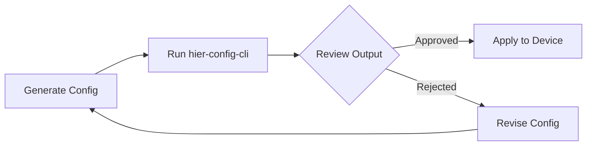
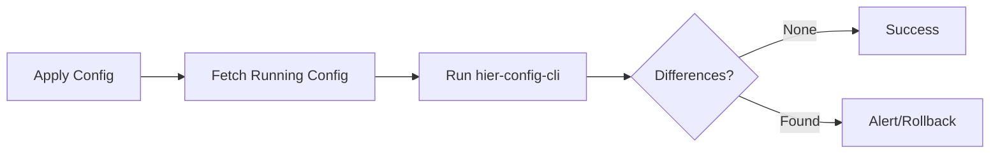
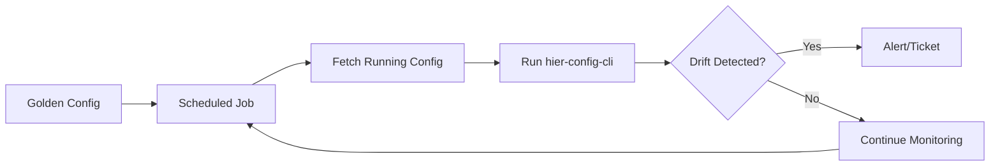

# Integration Overview

hier-config-cli is designed to integrate seamlessly with various automation tools and workflows. This section provides examples and best practices for integrating hier-config-cli into your network automation stack.

## Integration Options

hier-config-cli can be integrated into your workflows in several ways:

### Command-Line Integration

- Direct shell execution
- Shell scripts and batch processing
- Cron jobs for scheduled tasks

### Automation Frameworks

- **[Nornir](nornir.md)**: Python-based automation framework
- **[Ansible](ansible.md)**: Configuration management and automation
- **[CI/CD Pipelines](cicd.md)**: GitHub Actions, GitLab CI, Jenkins

### Programmatic Integration

- Subprocess calls from Python
- REST API wrappers
- Custom automation tools

## Common Integration Patterns

### Pre-Change Validation

Use hier-config-cli to validate configuration changes before applying them:



### Post-Change Verification

Verify that changes were applied correctly:



### Configuration Compliance

Continuously check for configuration drift:



## Integration Best Practices

### 1. Error Handling

Always check exit codes and handle errors appropriately:

```bash
#!/bin/bash

if hier-config-cli remediation \
  --platform ios \
  --running-config running.conf \
  --generated-config intended.conf \
  --output remediation.txt; then
  echo "Remediation generated successfully"
else
  echo "Error generating remediation"
  exit 1
fi
```

### 2. Logging

Enable verbose logging for troubleshooting:

```bash
# Add to your automation scripts
hier-config-cli -vv remediation \
  --platform ios \
  --running-config running.conf \
  --generated-config intended.conf \
  2>> hier-config-cli.log
```

### 3. File Management

Organize configuration files systematically:

```
configs/
├── running/
│   ├── router1_running.conf
│   ├── router2_running.conf
│   └── switch1_running.conf
├── intended/
│   ├── router1_intended.conf
│   ├── router2_intended.conf
│   └── switch1_intended.conf
└── output/
    ├── remediation/
    ├── rollback/
    └── future/
```

### 4. Version Control

Store all configurations in Git:

```bash
# Commit intended configs
git add configs/intended/
git commit -m "Update intended configurations"

# Generate and commit remediation
hier-config-cli remediation \
  --platform ios \
  --running-config configs/running/router1.conf \
  --generated-config configs/intended/router1.conf \
  --output configs/output/remediation/router1.txt

git add configs/output/remediation/router1.txt
git commit -m "Generate remediation for router1"
```

### 5. Parallel Processing

Process multiple devices concurrently:

```bash
#!/bin/bash

# Process devices in parallel
for device in router1 router2 switch1; do
  (
    hier-config-cli remediation \
      --platform ios \
      --running-config configs/running/${device}.conf \
      --generated-config configs/intended/${device}.conf \
      --output configs/output/remediation/${device}.txt
  ) &
done

# Wait for all background jobs
wait

echo "All devices processed"
```

## Integration Examples

### Quick Reference

| Tool/Platform | Page | Use Case |
|---------------|------|----------|
| Nornir | [Nornir Integration](nornir.md) | Python-based automation at scale |
| Ansible | [Ansible Integration](ansible.md) | Configuration management |
| GitHub Actions | [CI/CD Integration](cicd.md) | Automated testing and validation |
| GitLab CI | [CI/CD Integration](cicd.md) | Pipeline integration |
| Jenkins | [CI/CD Integration](cicd.md) | Legacy CI/CD systems |

### Simple Shell Script

```bash
#!/bin/bash
# simple-remediation.sh

DEVICE=$1
PLATFORM=$2

hier-config-cli remediation \
  --platform ${PLATFORM} \
  --running-config configs/running/${DEVICE}.conf \
  --generated-config configs/intended/${DEVICE}.conf \
  --output configs/output/${DEVICE}_remediation.txt

echo "Remediation generated for ${DEVICE}"
```

Usage:
```bash
./simple-remediation.sh router1 ios
```

### Python Wrapper

```python
#!/usr/bin/env python3
"""Simple Python wrapper for hier-config-cli."""

import subprocess
import sys
from pathlib import Path

def generate_remediation(device: str, platform: str) -> bool:
    """Generate remediation for a device."""
    cmd = [
        "hier-config-cli",
        "remediation",
        "--platform", platform,
        "--running-config", f"configs/running/{device}.conf",
        "--generated-config", f"configs/intended/{device}.conf",
        "--output", f"configs/output/{device}_remediation.txt",
    ]

    try:
        result = subprocess.run(cmd, check=True, capture_output=True, text=True)
        print(f"✓ Remediation generated for {device}")
        return True
    except subprocess.CalledProcessError as e:
        print(f"✗ Error generating remediation for {device}: {e.stderr}")
        return False

if __name__ == "__main__":
    if len(sys.argv) != 3:
        print("Usage: wrapper.py <device> <platform>")
        sys.exit(1)

    device = sys.argv[1]
    platform = sys.argv[2]

    success = generate_remediation(device, platform)
    sys.exit(0 if success else 1)
```

## Next Steps

Explore specific integration guides:

- **[Nornir Integration](nornir.md)**: Scale automation across many devices
- **[Ansible Integration](ansible.md)**: Integrate with Ansible playbooks
- **[CI/CD Integration](cicd.md)**: Automate validation in pipelines
